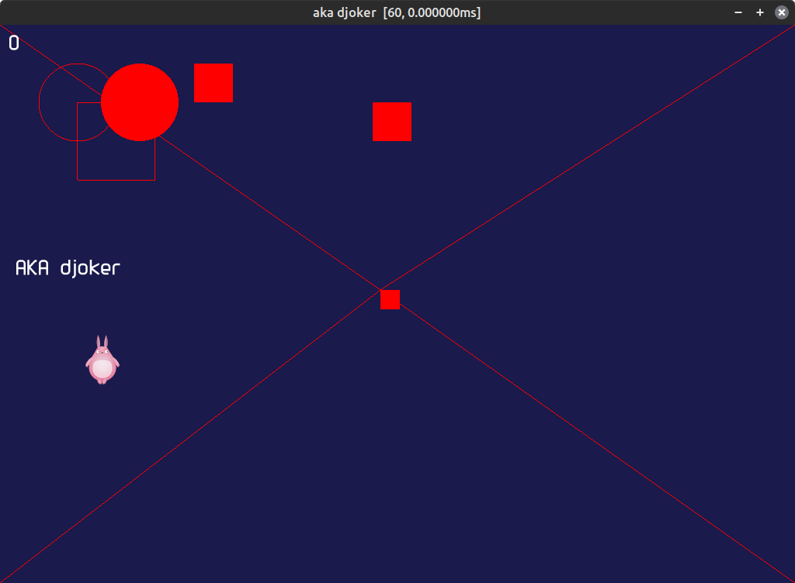
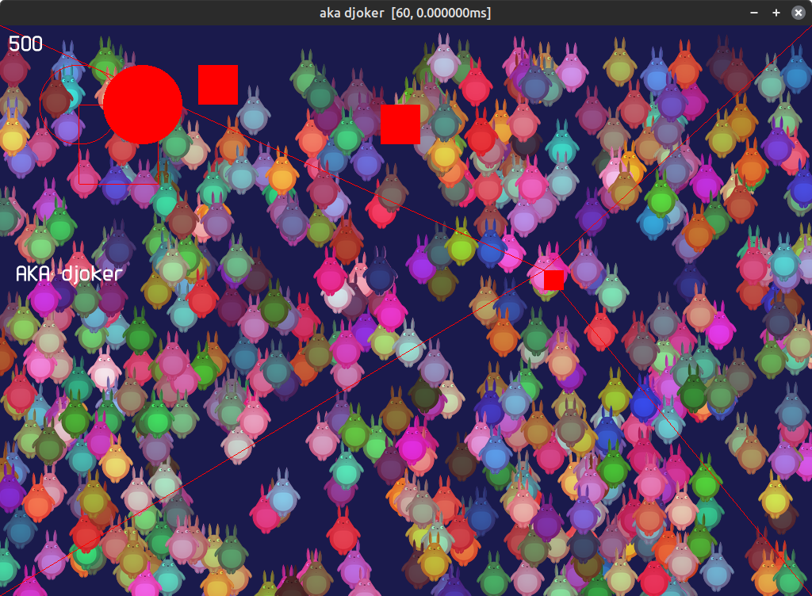

Opengl Batch and simple render.

Project Summary

The project is a C++ application using the SDL library for creating a graphical window and OpenGL for 2D rendering. The code is organized into classes representing graphic primitives, drawing batches, and data structures for texture manipulation. Here are some of the main components:
Core Classes:

    Batch: Responsible for storing and rendering a large number of 2D primitives. It uses a buffer to optimize performance, resetting when it reaches a limit.

    Primitives: Provides methods to draw various 2D primitives, such as lines, rectangles, and circles. It uses a buffer system to store and render the primitives.

Main Features:

    Drawing of 2D primitives, such as rectangles, circles, and lines.
    Use of a batching system to optimize drawing performance.
    Handling of mouse and keyboard input events.
    Rendering of text using a loaded font.

# Some screenshots

